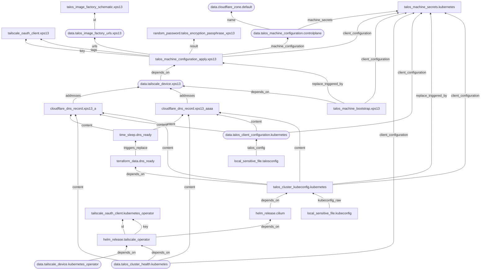

# OpenTofu configurations

This repository contains OpenTofu configuration for my personal Kubernetes cluster.

## Providers used



### Tailscale ([`tailscale.tf`](./tailscale.tf))

- OAuth credential for Talos nodes and [Tailscale Kubernetes Operator](https://tailscale.com/docs/features/kubernetes-operator) (`tailscale_oauth_client`)

### Talos Linux ([`talos.tf`](./talos.tf), [`talos-patches-common.tf`](./talos-patches-common.tf), [`talos-controlplane.tf`](./talos-controlplane.tf), [`talos-xps13.tf`](./talos-xps13.tf))

- Machine secrets for the cluster (`talos_machine_secrets`)
- Schematic from [Image Factory](https://factory.talos.dev/) (`talos_image_factory_schematic`)
- Generated password for disk encryption (`random_password`)
- Installation and bootstrapping of nodes (`talos_machine_configuration_apply` and `talos_machine_bootstrap`)

### Cloudflare ([`cloudflare.tf`](./cloudflare.tf))

- `A` and `AAAA` records for control plane nodes (`cloudflare_dns_record`)
- Delayed creation of resource to wait for DNS propagation (`time_sleep`)
- Execution of [Python script](./scripts/check_dns.py) to check for DNS propagation (`terraform_data` with `local-exec`)

### Helm ([`helm.tf`](./helm.tf))

- Helm charts for [Cilium](https://cilium.io/) and [Tailscale Kubernetes Operator](https://tailscale.com/docs/features/kubernetes-operator) `helm_release`

## Applying the configuration

OpenTofu is required due to the usage of [state and plan encryption](https://opentofu.org/docs/language/state/encryption/); using Terraform without it may work, but it has not been tested. Python 3 is also required for local script execution.

If the system uses [Nix](https://nixos.org/), running the following command, at the root directory of the cloned project, starts an interactive shell with required packages:

```sh
nix-shell --pure
```

### Environment variables

This configuration assumes that some environment variables are set prior to the following steps.

#### `s3` backend

Backblaze B2 is used for storing the state.

- `AWS_SECRET_ACCESS_KEY`: the application key to access the bucket with. The following capabilities are required: `deleteFiles`, `listBuckets`, `listFiles`, `readFiles`, and `writeFiles`
- `AWS_ACCESS_KEY_ID`: the ID of the abovementioned application key
- `AWS_ENDPOINT_URL_S3`: S3 API endpoint, such as `https://s3.us-west-002.backblazeb2.com`

#### `cloudflare` provider

- `CLOUDFLARE_API_TOKEN`: the API token for Cloudflare operations

#### `tailscale` provider

- `TAILSCALE_OAUTH_CLIENT_SECRET`: the OAuth credential used for deployment
- `TAILSCALE_OAUTH_CLIENT_ID`: the ID of the abovementioned OAuth credential

### Input variables

Accepted input variables are defined at [`variables.tf`](./variables.tf). The following do not have default values and thus need to be manually set:

- `state_passphrase`: the passphrase used for encrypting and decrypting state and plan data
- `cloudflare_zone_id`: Cloudflare zone ID

### Backend configuration

During initialisation, the name of the bucket for storing the state needs to be provided. It can be done interactively, or by manually providing the configuration.

```sh
# Initialise backend interactively
tofu init

# Initialise backend with configuration
tofu init -backend-config="bucket=<bucket-name>"
```

### `plan` and `apply`

When the backend is ready, run the following to apply the configuration:

```sh
tofu plan -out=tfplan
tofu apply tfplan
```
